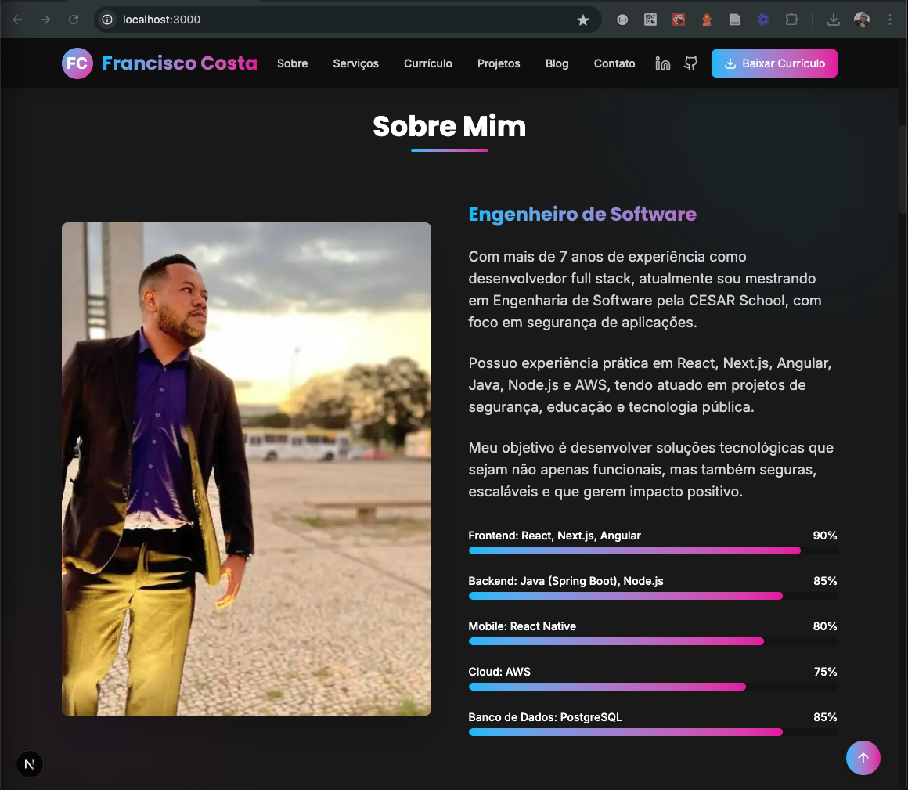

# 🚀 Francisco Costa - Landing Page

Este é o repositório da minha **Landing Page Pessoal**, desenvolvida com **Next.js 15** e **Tailwind CSS v4**, focada em apresentar meu portfólio, experiência profissional e formas de contato.

---

## 📄 Sobre o projeto

A landing page tem como objetivo:

- Apresentar de forma moderna e responsiva meu perfil profissional.
- Mostrar habilidades, experiências e projetos realizados.
- Facilitar o contato com recrutadores, empresas e parceiros.

O layout é 100% responsivo, otimizado para performance e SEO, com animações leves usando **Framer Motion**.

---

## 🛠️ Tecnologias Utilizadas

- [Next.js 15](https://nextjs.org/)
- [Tailwind CSS v4](https://tailwindcss.com/)
- [TypeScript](https://www.typescriptlang.org/)
- [Framer Motion](https://www.framer.com/motion/)
- [Lucide React Icons](https://lucide.dev/)

---

## 🎨 Funcionalidades

- Tema escuro por padrão (modo `dark`).
- Scroll suave entre seções.
- Animações suaves de entrada (fade-in, bounce).
- Barra de navegação com suporte a responsividade.
- Formulário de contato integrado.
- Layout modularizado em componentes para fácil manutenção.

---

## 📦 Como rodar o projeto

Clone o repositório:

```bash
git clone https://github.com/seu-usuario/seu-repo.git
```

Entre no diretório:

```bash
cd seu-repo
```

Instale as dependências:

```bash
npm install
```

Rode o servidor de desenvolvimento:

```bash
npm run dev
```

Abra [http://localhost:3000](http://localhost:3000) para visualizar no navegador.

---

## 📂 Estrutura de Pastas

```
├── app/
│   ├── favicon.ico
│   ├── globals.css
│   ├── layout.tsx
│   └── page.tsx
├── components/
│   ├── ui/
│   ├── about.tsx
│   ├── blog.tsx
│   ├── certifications.tsx
│   ├── contact.tsx
│   ├── footer.tsx
│   ├── header.tsx
│   ├── hero.tsx
│   └── ....
├── public/
│   └── imagens, ícones e documentos
├── styles/
│   └── theme.css
└── package.json
```

---

## ✨ Melhorias Futuras

- Integração com CMS (Ex: Contentful ou Strapi) para tornar o conteúdo dinâmico.
- Implementação de notificações de formulário de contato.
- Adicionar SEO avançado e OpenGraph tags para compartilhamento em redes sociais.

---

## 👨‍💻 Autor

**Francisco Costa**  
[LinkedIn](https://linkedin.com/in/chicaodw) • [GitHub](https://github.com/chicaodw1) • [Instagram](https://instagram.com/chicaodw)

---

**_Feito com dedicação, buscando sempre a excelência no desenvolvimento._**

---

## ⚡ Preview

> __
